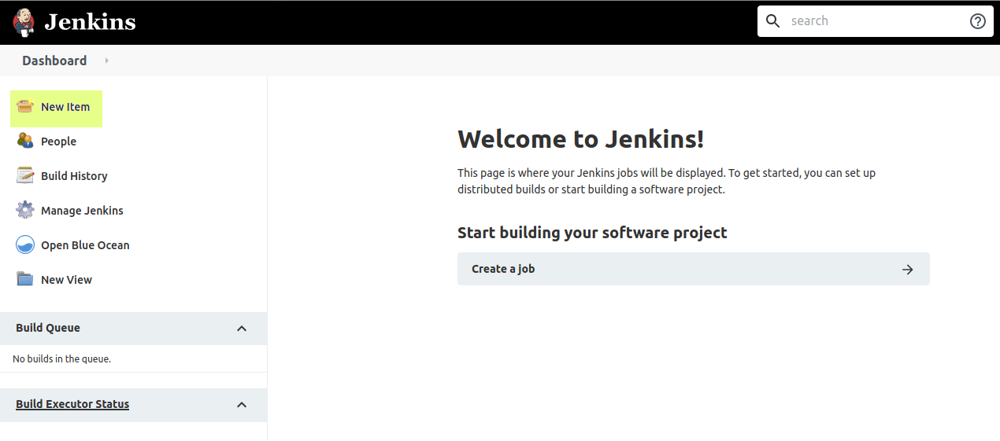
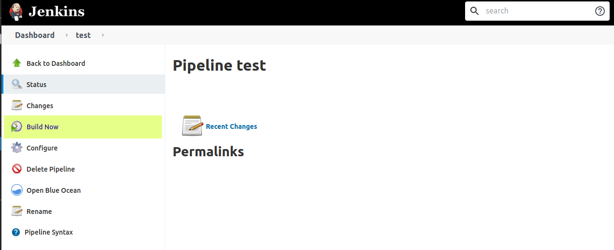
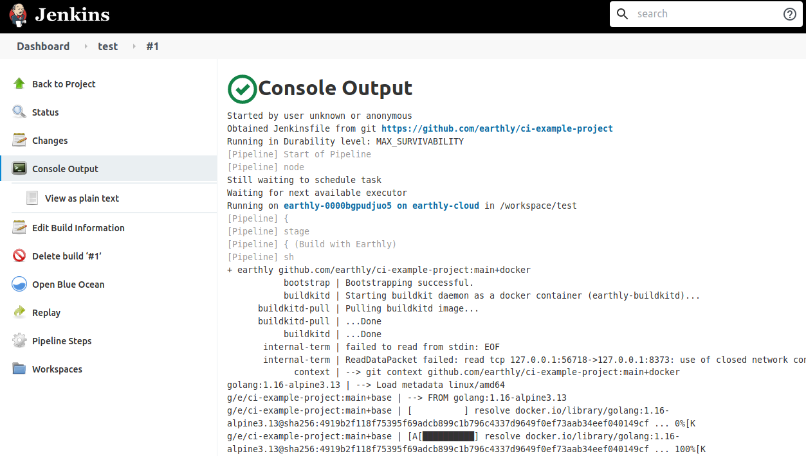

# Jenkins

## Example

You can find our [Jenkins example here](https://github.com/earthly/ci-examples/tree/main/jenkins).

To run it yourself, clone the [`ci-examples` repository](https://github.com/earthly/ci-examples), and then run (from the root of the repository):

```go
earthly ./jenkins+start
```

This will start a local Jenkins server, minimally configured to spawn `earthly` builds using the Docker cloud plugin.

To run a build in this demo, you will need to configure a build pipeline. To do that, we have an [example project with a Jenkinsfile in it here](https://github.com/earthly/ci-example-project). To configure the build pipeline for the example project:

- Open the Jenkins demo by going to [http://localhost:8000](http://localhost:8080/)
- Click "New Item", on the left



- Choose "Pipeline", give it a name (we chose "test"), and click "OK".


- Scroll down to the "Pipeline" section.
- Make the following changes:
    - Choose "Pipeline script from SCM" for the Definition
    - Choose "Git" as the SCM, once the option appears
    - Set the repository URL to [`https://github.com/earthly/ci-example-project`](https://github.com/earthly/ci-example-project)
    - Set the branch specifier to `*/main`


- Once those changes are made, click "Save". Jenkins will navigate to the Pipelines' main page. Once there, click "Build Now"



- Find the build in your build history, and watch it go!



### Building the Runner

To build our example Jenkins runner (`earthly`, `buildkit`, and `java`), run: `earthly ./jenkins+jenkins-earthly-runner`. You can then push this image anywhere you need for testing.

### Cleanup

If you broke the example environment, you can run `earthly ./jenkins+cleanup` to clean up before trying to run again from scratch.

## Details

`earthly` has been tested with Jenkins in both dedicated node (using a local installation) and using a cloud via a custom runner image.

### Constructing A Runner Image

The example uses an `earthly` published image named `earthly/earthly-jenkins`. Please, do not base your image off this one; copy our work and adapt it to your own needs. Earthly makes no commitment to keep this image consistently updated.

It's easiest to start from our base `earthly/earthly` image and build up a runner image from scratch. [Our example is here](https://github.com/earthly/ci-examples/blob/ce20840cffd2a8b04a8bd5dce477751adac3f490/jenkins/Earthfile#L48-L54). This image simply installs Java, and relies on Jenkins to inject the runner for us.

If you want to install the runner yourself, add these lines to your image build:

```docker
ARG VERSION=4.9
RUN apk add --update --no-cache curl bash git git-lfs openssh-client openssl procps \
  && curl --create-dirs -fsSLo /usr/share/jenkins/agent.jar https://repo.jenkins-ci.org/public/org/jenkins-ci/main/remoting/${VERSION}/remoting-${VERSION}.jar \
  && chmod 755 /usr/share/jenkins \
  && chmod 644 /usr/share/jenkins/agent.jar \
  && ln -sf /usr/share/jenkins/agent.jar /usr/share/jenkins/slave.jar \
  && apk del curl
```

Ensure that `VERSION` is set to the version of the agent you would like to install.

[See our documentation for more general information on building your own CI image](../build-an-earthly-ci-image.md).

## Runner Configuration Notes

### TLS

The example purposely runs a Docker-In-Docker (DIND) container without TLS for simplicity. This is *not* a recommended configuration. [See here for configuring TLS inside Docker.](https://docs.docker.com/engine/security/protect-access/#use-tls-https-to-protect-the-docker-daemon-socket) 

To allow the `docker` client to access a daemon protected with TLS, you will need to add Jenkins credentials. Add the client key, certificate, and the server CA certificate as a credential. In our example, using the Docker Cloud provider, you can add them by choosing "Manage Jenkins", then "Manage Nodes and Clouds", and finally "Configure Clouds".  Then, choose the cloud to configure for TLS, and click the "Add" button here:


Also, ensure that you are using the correct port for TLS. In this image of our example cloud, we are using port `2375`, which is traditionally the insecure port for a `docker` daemon. In a TLS environment, `docker` expects port `2376`.

If you are using an external `earthly-buildkitd` with Jenkins, [you should be using mTLS](../remote-buildkit.md). You will need to add the keys and certificates used there as credentials too.

### Recommended Settings

`earthly` misinterprets the Jenkins environment as a terminal. To hide the ANSI color codes, set `NO_COLOR` to `1`.